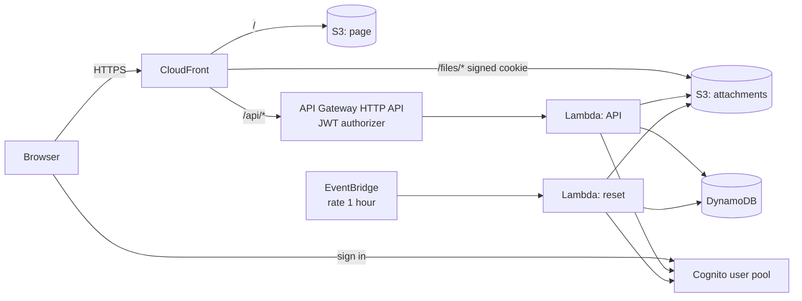

# wiki-serverless-aws

A personal wiki inspired by [TiddlyWiki](https://tiddlywiki.com), running serverless on AWS. There is no server to patch and nothing runs while nobody uses it, so a small wiki costs a few cents a month.

Notes are *tiddlers*: a title, text and tags. Open tiddlers form a story river; a link opens the next one right below the current one. Everything is stored in DynamoDB and S3 behind Cognito sign-in.

## Demo

**https://d1grd9lz4vxssg.cloudfront.net**

Sign in with `admin@example.com` / `admin123` (the fields are filled in for you).

The demo is public and wiped every hour: all tiddlers, drafts, uploaded files and users go away, and the admin password is put back. Two-step sign-in works in the demo too; the wipe turns it off for the admin, so nobody can lock the shared account for longer than an hour. A few example tiddlers — a video, a photo, a table, task lists and lorem ipsum — are written again after each wipe, so they are always there. Invitations do not send email in the demo; the temporary password is shown to the administrator instead.

## Features

- TiddlyWiki-style wikitext (`''bold''`, `//italic//`, `[[links]]`, `{{transclusion}}`, tables, lists, `<<macros>>`), Markdown or plain text per tiddler.
- Tags, backlinks, missing links, full-text search, recent changes.
- Full history of every save, rename and delete, with restore into the editor.
- Autosaved drafts and open tiddlers, per user, restored on any device.
- Task lists (`* [ ] task`) with live checkboxes and a `<<todo>>` summary.
- Photo upload with a desktop-sized WebP copy and the original on click; video player for mp4/webm/mov/ogv.
- Interface in English, Russian, French and Italian, following the system language.
- Optional two-step sign-in with an authenticator app (TOTP), turned on, switched to another app or off in the settings by each user.
- Settings for administrators: invite, disable and delete users, see who has two-step sign-in and reset it for a lost phone; remove files no tiddler refers to.

Text is never parsed as HTML: the page builds DOM nodes itself, and uploaded files are served with a sandboxing Content-Security-Policy.

### Loading on demand

At sign-in the page gets the list of tiddlers without their text: title, tags, dates, authors, `etag`, size and the titles each tiddler links to. The text of a tiddler is loaded when it is opened; open tiddlers, `{{transclusions}}` and texts needed for an edit come in batches of up to 100. The list comes from a DynamoDB index that holds everything but the text.

What used to need every text works without it:

- backlinks and the Missing tab use the links the server works out on every save (`links`; tiddlers saved before get them on the first listing);
- search matches titles, tags and the texts already loaded at once, and the server searches every text 300 ms after typing stops;
- `<<todo>>` asks the server for the open tasks; a tick from the summary loads that tiddler's text and saves it.

The server and the page use the same rules for links and tasks (`extract_links` and `scan_tasks` in `lambda_app.py`, `links` and `tasks` in `wikitext.js`).

## Architecture



| Part | Service |
| --- | --- |
| Page | S3 + CloudFront (default `*.cloudfront.net` domain and certificate) |
| Sign-in | Cognito user pool, no self sign-up |
| API | API Gateway HTTP API with a Cognito JWT authorizer, Lambda (Python, arm64) |
| Tiddlers, history, drafts | DynamoDB on demand, one table |
| Attachments | Private S3 bucket read through CloudFront with a one-hour signed cookie |
| Demo reset | Lambda `reset.py`, EventBridge rule `rate(1 hour)` |

## What it costs

Nothing runs between requests, and most services fall within the AWS always-free allowances (Lambda 1M requests and 400,000 GB-s, CloudFront 1 TB and 10M requests, Cognito 10,000 monthly active users, DynamoDB 25 GB storage, CloudWatch Logs 5 GB). What remains is paid per request.

Estimate for **light use** — a handful of people, 20,000 API calls, 2,000 saves, 1 GB of attachments and 5 GB of traffic a month — at `eu-central-1` list prices:

| Service | Usage | Price | Per month |
| --- | --- | --- | --- |
| Lambda (API + 720 hourly resets) | ~21,000 invocations, 256 MB | free allowance | $0.00 |
| API Gateway HTTP API | 20,000 requests | ~$1.20 per million | $0.02 |
| DynamoDB on demand | 2,000 writes, 50,000 reads, < 1 GB | ~$0.76 / $0.15 per million, storage free | $0.01 |
| DynamoDB point-in-time recovery | < 0.1 GB | ~$0.24 per GB | < $0.01 |
| S3 (page + attachments) | 1 GB, ~10,000 requests | ~$0.0245 per GB | $0.03 |
| CloudFront | 5 GB, 100,000 requests | free allowance | $0.00 |
| Cognito | < 10,000 active users | free allowance | $0.00 |
| CloudWatch Logs | < 1 GB | free allowance | $0.00 |
| **Total** | | | **≈ $0.07** |

With **heavy use** — 1 million API calls and 10 GB of attachments — it grows to roughly $1.20 (API Gateway) + $0.25 (S3) + $0.30 (DynamoDB) ≈ **$2 a month**. A WAF web ACL is left out on purpose: it alone would cost about $5–6 a month.

Prices are approximate and change over time; check the AWS pricing pages for your region.

## Deploy

### What you need

1. An S3 bucket for Terraform state. The workflow uses the S3 backend with the native lockfile (Terraform 1.10+), so no DynamoDB lock table is needed.
2. AWS credentials allowed to create the resources above. Every resource name starts with `wiki-serverless` (the `name` variable), which makes a least-privilege policy easy.
3. In the GitHub repository:
   - secrets `AWS_ACCESS_KEY_ID` and `AWS_SECRET_ACCESS_KEY`;
   - variable `TF_STATE_BUCKET` with the state bucket name.

### GitHub Actions

`.github/workflows/terraform.yml`:

- every push and pull request, three jobs side by side: `terraform fmt` and `terraform validate`; Lambda tests; frontend tests (see [Tests](#tests));
- pull requests from this repository: `terraform plan`, summary in the run;
- push to `main` or a manual run: plan and apply once all three pass. The job stops if the plan would destroy or replace a bucket, the table or the user pool; such a change has to be applied by hand.

The site address is printed in the run summary and in `terraform output site_url`.

### From a workstation

```bash
terraform init \
  -backend-config="bucket=<state bucket>" \
  -backend-config="key=wiki-serverless-aws/terraform.tfstate" \
  -backend-config="region=eu-central-1"
terraform apply
```

### Demo or private wiki

The defaults set up the public demo. For a private wiki, change them in a `terraform.tfvars`:

| Variable | Demo | Private wiki |
| --- | --- | --- |
| `demo` | `true` — the sign-in screen shows and fills in the admin sign-in | `false` — nothing is shown |
| `admin_email`, `admin_password` | `admin@example.com`, `admin123` | your own |
| `reset_schedule` | `rate(1 hour)` | `""` — no reset and no example tiddlers |
| `invite_emails` | `false` | `true` — Cognito emails the invitation |
| `password_min_length` | `8` | `12` or more |
| `file_max_bytes` | 10 MB | up to what you are ready to store |

## Repository layout

| Path | What is there |
| --- | --- |
| `*.tf` | Terraform |
| `web/` | The page: `app.js` (interface), `wikitext.js` (markup), `i18n.js` (translations), `styles.css`, `index.html` |
| `lambda/lambda_app.py` | API, with tests in `lambda_app_test.py` |
| `lambda/reset.py` | Hourly demo reset, with tests in `reset_test.py` |
| `seed/` | Example tiddlers of the demo (`tiddlers.json`) and their files, uploaded to `files/seed/` |
| `tests/web/` | Frontend tests |
| `cloudfront/api_host.js` | CloudFront function that passes the site address to the API for the file cookie |
| `.github/workflows/` | CI and deployment |

## Tests

```bash
cd lambda && python -m unittest -v lambda_app_test reset_test
cd tests/web && npm ci && npm test
```

**Lambda** (`lambda/*_test.py`, Python `unittest`). The handlers run against in-memory stand-ins for DynamoDB, S3 and Cognito, with requests built the way API Gateway sends them:

- tiddlers: create, edit with a stale `etag`, rename, delete, history; the list without text, texts in batches, links worked out for old tiddlers, server search and tasks;
- open tiddlers and drafts per user, draft limits, error messages in the page language, titles that would break links;
- administration: only the `admins` group gets in, invite, disable and delete users, no locking yourself out, cleanup of only old unused files;
- CloudFront cookie signing, checked byte for byte against `openssl`;
- the demo reset: wipes the table, every file version and other users, brings the admin back and writes the example tiddlers again, keeping their files; every file and link in the examples exists.

**Frontend** (`tests/web/`, `node --test`):

| File | What it checks |
| --- | --- |
| `wikitext.test.js` | The markup renderer in jsdom: wikitext and Markdown, links, lists, tables, media, transclusion and its depth limit, macros, task lists. Text such as `<script>`, `onerror=` or `javascript:` links never turns into anything that runs. |
| `i18n.test.js` | Every interface string has English, French and Italian text with the same `{placeholders}`; help in each language; the system language is picked unless one was chosen; plural forms. |
| `parity.test.js` | The page and the Lambda find the same links and tasks in about 500 documents, since backlinks and `<<todo>>` come from the server. Needs `python3`. |
| `ui.test.js` | The page in headless Chrome against an in-memory API: sign-in, only the texts on screen are loaded, create and edit, a conflicting save keeps the editor, ticking a task, `<<todo>>`, search, open tiddlers after a reload, switching language. Chrome is found on the usual paths or taken from `CHROME_PATH`; without it these tests are skipped locally and fail in CI. |

## Stress test

Run on the demo on 27 September 2026: 3,000 tiddlers created through the API, then the interface measured in headless Chrome on a MacBook over a home connection.

**Data.** 3,000 tiddlers, 11.7 MB of text: most 0.5–3 KB, 9 % 5–20 KB, 1 % 50–100 KB; 40 tags, 10 % Markdown, headings, lists, tables, code, 11,466 open tasks, links between tiddlers and to 50 missing pages, 156 tiddlers with `{{transclusion}}`.

| What | Result |
| --- | --- |
| Creating 3,000 tiddlers, 8 parallel writers | 150 s, 0 failures. 20 saves/s: the API Gateway stage limit (`throttling_rate_limit = 20`); 781 requests got 429 and succeeded on retry |
| Save latency | p50 175 ms, p95 229 ms, max 3.6 s (a retry wait) |
| Data at sign-in | 1.46 MB of tiddler list in 2 pages, plus 13 KB of text for the open tiddlers |
| Sign-in until the page shows | 4.3–4.6 s (three runs) |
| Opening a tiddler not loaded yet | 160–200 ms, one request for its text |
| Search | titles and tags at once; all text 2.6 s on the server |
| `<<todo>>` over the whole wiki (11,466 tasks) | 3.9 s on the server |
| All tab (3,000 rows), Missing tab (50) | from the stored links, no text needed |
| Worst transclusion tree | 6 renders: the depth limit keeps `{{…}}` from exploding |
| JavaScript heap after the test | 8 MB |

**Conclusion.** Sign-in grows with the number of tiddlers, not with their text: the list is about 0.5 KB a tiddler, most of it the titles each one links to. Full-text search and `<<todo>>` read the whole table on the server, so they take a few seconds on a wiki of this size.

## Limits

- Everyone signed in sees and edits every tiddler; there are no per-page permissions.
- The list of all tiddlers (without text) is loaded at sign-in, and full-text search and `<<todo>>` scan the whole table. That is fine for tens of thousands of tiddlers, not for millions.
- The Cognito invitation email has one language for the whole pool.
