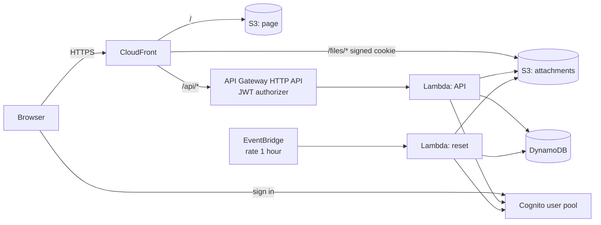

# wiki-serverless-aws

A personal wiki inspired by [TiddlyWiki](https://tiddlywiki.com), running serverless on AWS. There is no server to patch and nothing runs while nobody uses it, so a small wiki costs a few cents a month.

Notes are *tiddlers*: a title, text and tags. Open tiddlers form a story river; a link opens the next one right below the current one. Everything is stored in DynamoDB and S3 behind Cognito sign-in.

## Demo

**https://d1grd9lz4vxssg.cloudfront.net**

Sign in with `admin@example.com` / `admin123` (the fields are filled in for you).

The demo is public and wiped every hour: all tiddlers, drafts, uploaded files and users go away, and the admin password is put back. Invitations do not send email in the demo; the temporary password is shown to the administrator instead.

## Features

- TiddlyWiki-style wikitext (`''bold''`, `//italic//`, `[[links]]`, `{{transclusion}}`, tables, lists, `<<macros>>`), Markdown or plain text per tiddler.
- Tags, backlinks, missing links, full-text search, recent changes.
- Full history of every save, rename and delete, with restore into the editor.
- Autosaved drafts and open tiddlers, per user, restored on any device.
- Task lists (`* [ ] task`) with live checkboxes and a `<<todo>>` summary.
- Photo upload with a desktop-sized WebP copy and the original on click; video player for mp4/webm/mov/ogv.
- Interface in English, Russian, French and Italian, following the system language.
- Settings for administrators: invite, disable and delete users; remove files no tiddler refers to.

Text is never parsed as HTML: the page builds DOM nodes itself, and uploaded files are served with a sandboxing Content-Security-Policy.

## Architecture



| Part | Service |
| --- | --- |
| Page | S3 + CloudFront (default `*.cloudfront.net` domain and certificate) |
| Sign-in | Cognito user pool, no self sign-up |
| API | API Gateway HTTP API with a Cognito JWT authorizer, Lambda (Python, arm64) |
| Tiddlers, history, drafts | DynamoDB on demand, one table |
| Attachments | Private S3 bucket read through CloudFront with a one-hour signed cookie |
| Demo reset | Lambda `reset.py`, EventBridge rule `rate(1 hour)` |

## What it costs

Nothing runs between requests, and most services fall within the AWS always-free allowances (Lambda 1M requests and 400,000 GB-s, CloudFront 1 TB and 10M requests, Cognito 10,000 monthly active users, DynamoDB 25 GB storage, CloudWatch Logs 5 GB). What remains is paid per request.

Estimate for **light use** — a handful of people, 20,000 API calls, 2,000 saves, 1 GB of attachments and 5 GB of traffic a month — at `eu-central-1` list prices:

| Service | Usage | Price | Per month |
| --- | --- | --- | --- |
| Lambda (API + 720 hourly resets) | ~21,000 invocations, 256 MB | free allowance | $0.00 |
| API Gateway HTTP API | 20,000 requests | ~$1.20 per million | $0.02 |
| DynamoDB on demand | 2,000 writes, 50,000 reads, < 1 GB | ~$0.76 / $0.15 per million, storage free | $0.01 |
| DynamoDB point-in-time recovery | < 0.1 GB | ~$0.24 per GB | < $0.01 |
| S3 (page + attachments) | 1 GB, ~10,000 requests | ~$0.0245 per GB | $0.03 |
| CloudFront | 5 GB, 100,000 requests | free allowance | $0.00 |
| Cognito | < 10,000 active users | free allowance | $0.00 |
| CloudWatch Logs | < 1 GB | free allowance | $0.00 |
| **Total** | | | **≈ $0.07** |

With **heavy use** — 1 million API calls and 10 GB of attachments — it grows to roughly $1.20 (API Gateway) + $0.25 (S3) + $0.30 (DynamoDB) ≈ **$2 a month**. A WAF web ACL is left out on purpose: it alone would cost about $5–6 a month.

Prices are approximate and change over time; check the AWS pricing pages for your region.

## Deploy

### What you need

1. An S3 bucket for Terraform state. The workflow uses the S3 backend with the native lockfile (Terraform 1.10+), so no DynamoDB lock table is needed.
2. AWS credentials allowed to create the resources above. Every resource name starts with `wiki-serverless` (the `name` variable), which makes a least-privilege policy easy.
3. In the GitHub repository:
   - secrets `AWS_ACCESS_KEY_ID` and `AWS_SECRET_ACCESS_KEY`;
   - variable `TF_STATE_BUCKET` with the state bucket name.

### GitHub Actions

`.github/workflows/terraform.yml`:

- every push and pull request: `terraform fmt`, `terraform validate`, Lambda unit tests, JavaScript syntax check;
- pull requests from this repository: `terraform plan`, summary in the run;
- push to `main` or a manual run: plan and apply. The job stops if the plan would destroy or replace a bucket, the table or the user pool; such a change has to be applied by hand.

The site address is printed in the run summary and in `terraform output site_url`.

### From a workstation

```bash
terraform init \
  -backend-config="bucket=<state bucket>" \
  -backend-config="key=wiki-serverless-aws/terraform.tfstate" \
  -backend-config="region=eu-central-1"
terraform apply
cd lambda && python -m unittest lambda_app_test reset_test
```

### Demo or private wiki

The defaults set up the public demo. For a private wiki, change them in a `terraform.tfvars`:

| Variable | Demo | Private wiki |
| --- | --- | --- |
| `demo` | `true` — the sign-in screen shows and fills in the admin sign-in | `false` — nothing is shown |
| `admin_email`, `admin_password` | `admin@example.com`, `admin123` | your own |
| `reset_schedule` | `rate(1 hour)` | `""` — no reset |
| `invite_emails` | `false` | `true` — Cognito emails the invitation |
| `password_min_length` | `8` | `12` or more |
| `file_max_bytes` | 10 MB | up to what you are ready to store |

## Repository layout

| Path | What is there |
| --- | --- |
| `*.tf` | Terraform |
| `web/` | The page: `app.js` (interface), `wikitext.js` (markup), `i18n.js` (translations), `styles.css`, `index.html` |
| `lambda/lambda_app.py` | API, with tests in `lambda_app_test.py` |
| `lambda/reset.py` | Hourly demo reset, with tests in `reset_test.py` |
| `cloudfront/api_host.js` | CloudFront function that passes the site address to the API for the file cookie |
| `.github/workflows/` | CI and deployment |

## Limits

- Everyone signed in sees and edits every tiddler; there are no per-page permissions.
- The whole wiki is loaded into the browser at sign-in, as in TiddlyWiki. That is fine for thousands of tiddlers, not for millions.
- The Cognito invitation email has one language for the whole pool.
